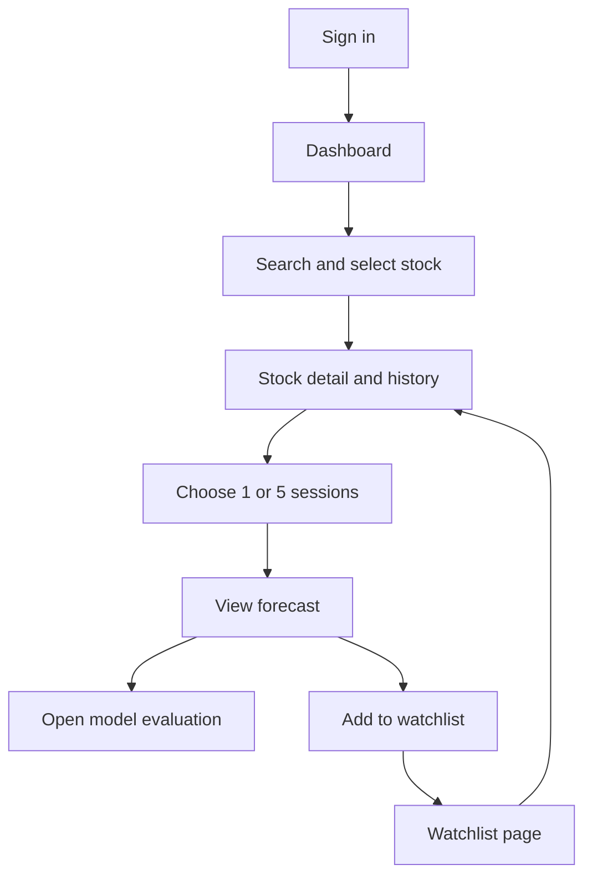

# 3. App Flow: MarketLens AI

**Status:** Proposed sample specification  
**Owner:** Product designer  
**Last updated:** 2026-10-06

## Pages and routes

| ID | Page | Route | Access | Features |
| --- | --- | --- | --- | --- |
| P-01 | Sign in | `/login` | Public | F-01 |
| P-02 | Dashboard | `/dashboard` | Analyst/admin | F-02 |
| P-03 | Stock detail | `/stocks/:stockId` | Analyst/admin | F-02, F-03, F-05 |
| P-04 | Forecast | `/stocks/:stockId/forecast?horizon=1` | Analyst/admin | F-04, F-05, F-06 |
| P-05 | Watchlist | `/watchlist` | Analyst/admin | F-05 |
| P-06 | Model evaluation | `/models/:modelId` | Analyst/admin, published models only | F-06 |
| P-07 | Administration | `/admin` | Admin only | F-07 |

The root route sends signed-in users to the dashboard and other users to sign-in. Header navigation exposes Dashboard and Watchlist, plus Administration for admins. Hiding the admin link supplements server-side authorization.

## Main forecast journey

## Actions and next states

| Current page | Action | System response | Next page or state | Failure and recovery |
| --- | --- | --- | --- | --- |
| P-01 | Click Sign in | Redirect through the configured identity provider and validate callback. | P-02 or a safe saved internal destination. | Show sign-in failure with retry. |
| P-02 | Type symbol or company name | Debounce search and query supported instruments. | Matching suggestions on P-02. | Show no matches or retryable service error. |
| P-02 | Select a result | Load instrument metadata and daily history. | P-03. | Show unsupported/not-found state with dashboard link. |
| P-03 | Select chart range | Reload the selected history range. | Updated chart on P-03. | Retain prior chart with an error message. |
| P-03 | Select horizon and click View forecast | Read the published forecast for that instrument and horizon. | P-04 with horizon in URL. | Show unavailable state with specific reason. |
| P-04 | Switch horizon | Update URL and load the matching forecast. | Updated P-04. | Show unavailable state for the selected horizon. |
| P-03 or P-04 | Click Add to watchlist | Save the current user's entry idempotently. | Same page; button becomes Added. | Preserve unsaved state and allow retry. |
| Any protected page | Click Watchlist | Load own saved stocks. | P-05. | Show empty state or retryable error. |
| P-05 | Click a stock | Load stock detail. | P-03. | Show not-found state if instrument was disabled. |
| P-05 | Click Remove | Delete own entry; update after success. | Updated P-05. | Keep entry visible with retry. |
| P-04 | Click Model evaluation | Load the report for the forecast's model ID. | P-06. | Show unavailable report state; never substitute another model's report. |
| P-07 | Click Import or Train | Confirm action and queue a job. | P-07 with pending job row. | Show validation error or existing equivalent job. |
| P-07 | Click Promote on eligible model | Confirm activation, recheck gates, and audit promotion. | P-07 with updated active model. | Keep existing active model and explain rejection. |
| Any protected page | Click Sign out | Invalidate the server session. | P-01. | If the request fails, show retry and retain accurate session state. |

## Forecast page content

Read top to bottom: stock identity and currency; data cutoff and freshness; selected horizon and target session; median return and projected adjusted price; historical line plus forecast endpoints and interval; model version; link to evaluation.

The chart does not invent prices between the cutoff and a five-session endpoint. A connector is labeled as a visual guide. The uncertainty range appears at the target session. Demo mode has a persistent banner on all data pages.

## Expected states

| State | UI behavior |
| --- | --- |
| Loading | Show skeletons; disable repeated submit actions; retain route context. |
| Empty search | Explain that only the five supported symbols are available. |
| Empty watchlist | Show a Search stocks action leading to P-02. |
| Missing model or inadequate history | Explain why the selected forecast is unavailable; offer history and evaluation where available. |
| Stale data | Show a dated freshness warning and keep original cutoff and target dates. |
| Provider failure | Keep the last valid published data visible with freshness status; do not generate fabricated replacement data. |
| Expired session | Redirect to P-01 with a validated internal return path. Do not automatically replay mutations after sign-in. |
| Access denied | Show an access-denied view with a dashboard link; direct API calls also return HTTP 403. |

## Navigation and interaction rules

Range and horizon choices belong in query parameters so refresh and browser back preserve the view. Read-only page refresh never queues training or imports. Duplicate watchlist writes are safe; admin job requests use idempotency keys and disable buttons while submitting.

Dialogs trap keyboard focus and restore it when closed. Search suggestions support arrow keys, Enter, and Escape. After navigation, move focus to the page heading. Provide a text/table alternative to chart data as specified in [Design Brief](design-brief.md).

Users cannot upload market data or models through the analyst interface. Admin job logs and candidate-model details remain restricted to P-07.
