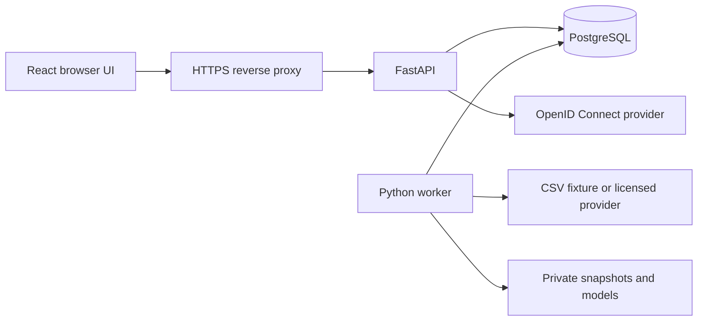

# 2. Technical Requirements Document: MarketLens AI

**Status:** Proposed sample specification  
**Owner:** Engineering lead  
**Last updated:** 2026-10-06

## Proposed technology stack

| Layer | Technology | Purpose |
| --- | --- | --- |
| Frontend | React, TypeScript, Vite | Typed page components and production asset builds. |
| Styling and charts | CSS variables and Apache ECharts | Shared design tokens, historical charts, and prediction bands. |
| API | Python and FastAPI | Validated API requests and authorization. |
| Persistence | PostgreSQL, SQLAlchemy, Alembic | Relational data, transactional job claiming, and migrations. |
| Data processing | pandas and NumPy | Validation, returns, and rolling features. |
| Machine learning | scikit-learn GradientBoostingRegressor | Median and quantile return models. |
| Authentication | OpenID Connect plus server-side sessions | External identity and HttpOnly session cookies. |
| Background processing | Separate Python worker, PostgreSQL job table | Imports, training, evaluation, and forecast generation. |
| Artifact storage | Private persistent filesystem volume | Immutable dataset snapshots, model files, and reports. |
| Deployment | Docker Compose on a Linux host, Nginx for HTTPS | Pilot packaging, service networking, and reverse proxy. |
| Verification | pytest, Vitest, Playwright | Data/model checks, component checks, and user journeys. |

Select compatible supported versions in T-01, record runtime versions, and commit Python and JavaScript dependency locks. No version set has been installed or verified in this documentation example.

## Architecture

The API reads published forecasts and queues admin jobs. It does not train models during a user request. The worker claims jobs transactionally, validates imports, evaluates candidates, and precomputes forecasts for enabled stock/horizon pairs. Only completed batches become visible.

After each completed market session, the worker waits for the configured provider publication deadline, imports bars, and generates forecasts with the active model. Training is an admin action in the MVP. Alerts identify stale input, failed jobs, and missed refreshes.

## Data and modeling contract

- **Input:** At least five years of daily bars where available; minimum 500 usable labeled sessions per stock/horizon after feature warm-up.
- **Features:** Lagged 1-, 5-, and 20-session log returns; 10- and 20-session rolling volatility; 10-, 20-, and 50-session moving-average ratios; and relative volume. All features use information available by the cutoff.
- **Target:** `log(adjusted_close[t+h] / adjusted_close[t])`, with `h` equal to 1 or 5 trading sessions.
- **Models:** Separate regressors for quantiles 0.10, 0.50, and 0.90 for each stock/horizon. Fix and record random seeds and hyperparameters.
- **Output:** Convert quantiles to adjusted-price estimates using `adjusted_close[t] * exp(predicted_log_return)`. The median is the central estimate; the 0.10 and 0.90 endpoints form a nominal 80% interval.
- **Sanity checks:** Reject nonfinite values, nonpositive projected prices, or crossed quantiles rather than publishing a malformed range.
- **Reproducibility:** Save input snapshot hash, adjustment policy, feature configuration, code revision, dependency lock hash, training boundaries, and artifacts. Load model files only from trusted worker output.

Quantile gradient boosting is demonstrated in the official [scikit-learn prediction-interval example](https://scikit-learn.org/stable/auto_examples/ensemble/plot_gradient_boosting_quantile.html). Its use here is a proposed experiment; its suitability for this stock dataset must be measured.

## Evaluation and release gates

Use expanding chronological folds for tuning and reserve the last 126 labeled sessions as the untouched final test window. Purge training labels whose target dates reach the next evaluation window; require a gap of at least the forecast horizon. Fit learned preprocessing only on each training partition. Chronological splitting follows the principles described in [scikit-learn's time-series cross-validation documentation](https://scikit-learn.org/stable/modules/cross_validation.html#time-series-split).

Compare median-return mean absolute error against the constant-zero-return baseline. Report directional accuracy with an explicit zero/tie rule, quantile loss, interval coverage, mean interval width, and sample count separately by symbol and horizon. Directional accuracy excludes exactly zero realized returns and reports the excluded count; exactly zero median predictions count as incorrect for nonzero outcomes.

Proposed promotion gates: finite ordered outputs; at least 100 evaluated target outcomes; median-return MAE no worse than the no-change baseline; and 70%-90% measured coverage for the nominal 80% interval. These are pilot policies, not accuracy claims or proof of profitable trading. Set them before opening the holdout. After a failed final test, do not repeatedly tune against it; use a new future holdout for a revised candidate.

Freeze the candidate before final testing. A deployed refit through a later cutoff is a new model version and requires its own untouched evaluation window. Keep the last eligible version active while newer candidates are evaluated.

Historical provider data can contain revisions or retrospective adjustments. Record whether point-in-time data is available; label evaluation using revised history as retrospective. Store evaluation forecasts separately from operational forecasts and do not present them as predictions actually issued in the past.

## API contract

| Endpoint | Access | Result |
| --- | --- | --- |
| `GET /api/session` | Signed in | Current user and role. |
| `GET /api/stocks?q=...` | Analyst/admin | Supported symbol and company-name matches. |
| `GET /api/stocks/{id}/history?range=1y` | Analyst/admin | Bars, adjustment basis, source, and dataset cutoff. |
| `GET /api/stocks/{id}/forecast?horizon=1` | Analyst/admin | Latest published estimate or explicit unavailable response. |
| `GET /api/models/{id}/evaluation` | Analyst/admin | Published report for a promoted or retired model. |
| `GET /api/watchlist` | Analyst/admin | Current user's entries only. |
| `PUT /api/watchlist/{stock_id}` | Analyst/admin | Idempotent addition to own list. |
| `DELETE /api/watchlist/{stock_id}` | Analyst/admin | Idempotent removal from own list. |
| `GET /api/admin/jobs` | Admin | Paginated job status and sanitized errors. |
| `POST /api/admin/jobs` | Admin | Validated import or training job; returns job ID with HTTP 202. |
| `POST /api/admin/models/{id}/promote` | Admin | Atomic activation only if evaluation gates pass. |

Accept horizons only in `{1,5}` and ranges only in `{3m,1y,all}`. Use bounded search input and page sizes. Return structured error codes: invalid input, unauthorized, forbidden, not found, forecast unavailable, or service unavailable. Forecast JSON includes `dataset_id`, `model_id`, `cutoff_date`, `target_date`, `horizon`, `currency`, `price_basis`, `median_price`, `lower_price`, `upper_price`, `median_return`, `nominal_coverage`, `generated_at`, `is_stale`, and `is_demo`.

## Security, environments, and operations

Use same-origin HTTPS, secure HttpOnly SameSite cookies, CSRF protection on mutations, and server-side checks for roles and ownership. Validate OIDC state, nonce, and PKCE; rotate the session on login. Sessions expire after eight hours or 30 minutes of inactivity. Keep provider keys and identity secrets out of browser bundles and logs.

Development uses synthetic fixtures and an isolated test identity provider; staging and production use separate databases, identities, credentials, and artifact volumes. Production must refuse development-auth configuration. Nginx terminates TLS; the database and artifacts remain private.

Configuration includes `DATABASE_URL`, `OIDC_ISSUER`, `OIDC_CLIENT_ID`, `OIDC_CLIENT_SECRET`, `SESSION_SECRET`, `MARKET_DATA_MODE`, `MARKET_DATA_API_KEY`, `PROVIDER_PUBLICATION_DELAY_MINUTES`, and `ARTIFACT_ROOT`. Commit an example environment file containing names and safe placeholders, never real secrets.

Provide liveness and readiness endpoints, structured job logs, freshness metrics, and failure alerts. At 20 concurrent users, cached forecast reads target p95 below two seconds. Validate current stable Chrome, Edge, Firefox, and Safari during release, including mobile layouts.

## Verification and deployment

Test causal feature construction, label purging, holidays, price adjustments, duplicate ingestion, interval ordering, promotion gates, session expiry, and ownership denial. End-to-end checks cover the journeys in [App Flow](app-flow.md).

Build locked dependencies, migrate the database, start services, check readiness, and run a staging smoke test. Keep the previous image and active model for rollback; recover incompatible schema changes from a verified backup. Live provider access, model metrics, load targets, and deployment remain unverified until implementation.
